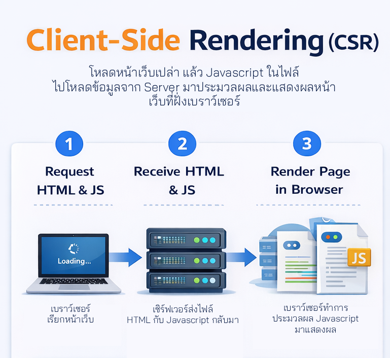
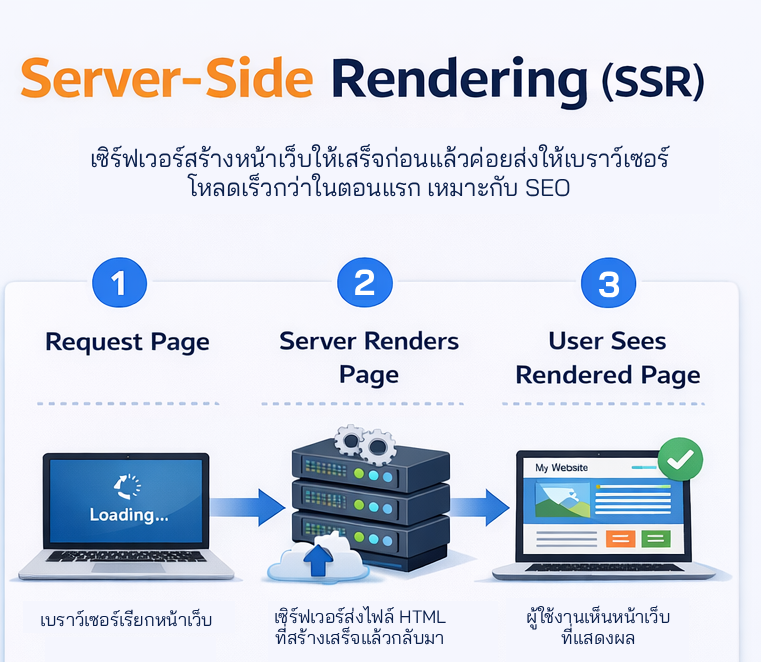
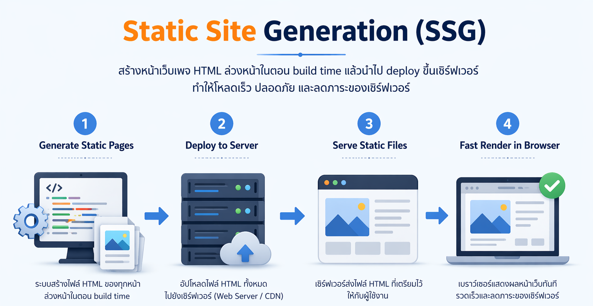

# Rendering Modes

ก่อนที่จะเริ่มสร้างโปรเจคด้วย Nuxt.js ต้องเข้าใจเกี่ยวกับกลยุทธ์การ Render ทั้ง 3 แบบของ framework Nuxt.js ก่อน

# 🏗️ ตารางเปรียบเทียบกลยุทธ์การ Render

| Mode              | วาดหน้าเว็บที่ไหน | วาดตอนไหน                    | ความเร็วหน้าแรก          | SEO       |
| ----------------- | ----------------- | ---------------------------- | ------------------------ | --------- |
| CSR (Client-side) | Browser           | เมื่อโหลด JS เสร็จ           | 🐢 ช้า (เห็นหน้าขาวก่อน) | ❌ ต่ำ    |
| SSR (Server-side) | Server            | เมื่อมีคนกดเรียก (Real-time) | ⚡ เร็ว (เห็นเนื้อหาเลย) | ✅ สูงมาก |
| SSG (Static)      | Server            | ตอนสั่ง Build (ทำล่วงหน้า)   | 🚀 เร็วที่สุด            | ✅ สูงมาก |

# 🔍 อธิบายแต่ละประเภท

1. CSR (Client-Side Rendering)

Browser จะได้รับไฟล์ HTML เปล่าๆ ไป แล้วต้องไปโหลด JavaScript ก้อนใหญ่มาเพื่อ "วาด" ทุกอย่างบนเครื่องผู้ใช้เอง

    เหมาะสำหรับ: ระบบหลังบ้าน (Dashboard), แอปที่ต้อง Login ก่อนเข้า (เพราะ Google ไม่ต้องเข้ามาเก็บข้อมูลอยู่แล้ว)

    ตัวอย่าง: ระบบจัดการสต็อกสินค้าภายในบริษัท, หน้าตั้งค่าโปรไฟล์ผู้ใช้

2. SSR (Server-Side Rendering)

เมื่อมีคนเรียกเข้าเว็บ Server จะประมวลผล (เช่น ดึงข้อมูลจาก Drizzle) แล้วส่ง HTML ที่ "วาดเสร็จแล้ว" ไปให้ Browser ทันที

    เหมาะสำหรับ: เว็บที่ข้อมูลเปลี่ยนบ่อยและต้องทำ SEO, เว็บที่ต้องการความเร็วในการเปิดครั้งแรก

    ตัวอย่าง: เว็บข่าว, ตลาดซื้อขายหุ้น/คริปโต, ระบบจองตั๋วเครื่องบิน

3. SSG (Static Site Generation)

เราวาดหน้าเว็บทุกหน้าเตรียมไว้ก่อน (Static HTML) ตั้งแต่ตอน Build เมื่อผู้ใช้เรียกเข้ามา เราแค่ส่งไฟล์นั้นให้เลยโดยไม่ต้องคำนวณใหม่

    เหมาะสำหรับ: เว็บที่ข้อมูลไม่ค่อยเปลี่ยน หรือเปลี่ยนไม่บ่อย (เช่น วันละครั้ง)

    ตัวอย่าง: บล็อกส่วนตัว, หน้า Landing Page สินค้า, เว็บไซต์บริษัท (Corporate Website)

